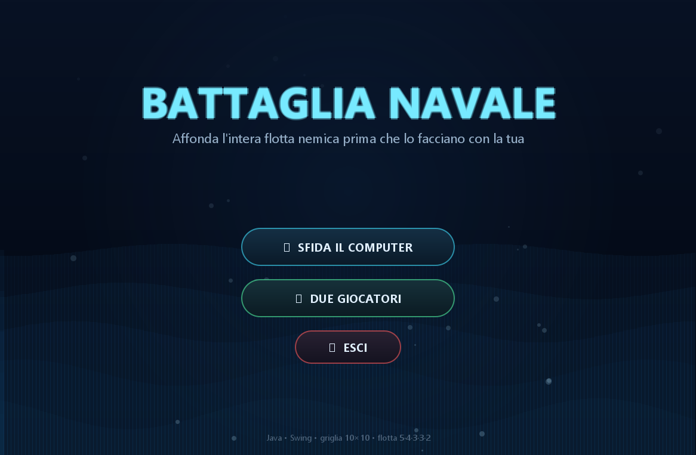
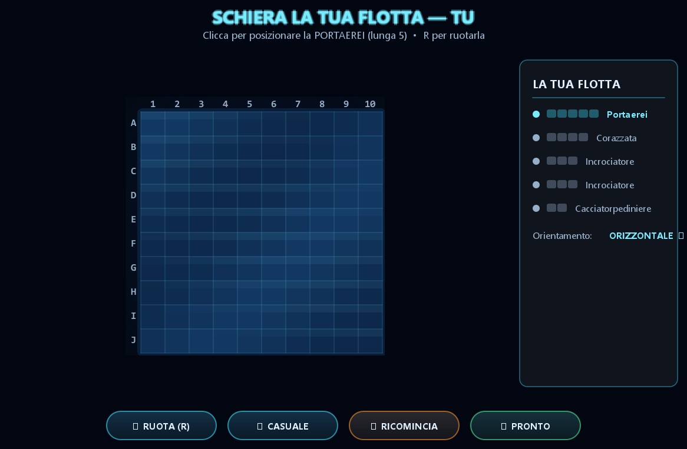
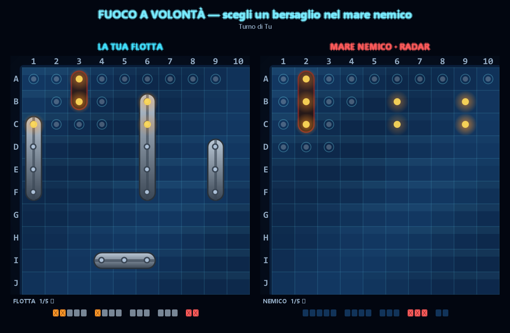

# Battaglia Navale — Edizione Grafica (GUI)

Il classico gioco della Battaglia Navale sviluppato in Java. L'applicazione dispone di un'interfaccia grafica animata che include il movimento ondoso del mare, navi in rilievo, mirino, animazioni di esplosioni e spruzzi d'acqua.

Sono disponibili due modalità di gioco:
* **Giocatore singolo contro il computer**, regolato da un'intelligenza artificiale basata sulla strategia "Caccia e Mira".
* **Due giocatori in locale sullo stesso PC**, con una schermata intermedia per garantire la riservatezza del turno.

Il progetto rappresenta l'evoluzione in ambiente grafico della versione da terminale, mantenendo inalterate le regole e la logica di gioco, ma introducendo una componente visiva realizzata interamente mediante Java 2D.

---

## Indice

* [Caratteristiche principali](#caratteristiche-principali)
* [Schermate dell'applicazione (Screenshot)](#schermate-dellapplicazione-screenshot)
* [Istruzioni di gioco](#istruzioni-di-gioco)
* [Struttura del codice](#struttura-del-codice)
* [Logica dell'Intelligenza Artificiale (Caccia e Mira)](#logica-dellintelligenza-artificiale-caccia-e-mira)
* [Dettagli tecnici](#dettagli-tecnici)
* [Informazioni sull'autore e contesto](#informazioni-sullautore-e-contesto)

---

## Caratteristiche principali

* **Grafica renderizzata tramite Java 2D**: include animazioni dell'acqua, modelli di navi in rilievo, effetti di esplosione, spruzzi e visualizzazione dei relitti delle navi affondate.
* **Intelligenza Artificiale "Caccia e Mira"**: esegue una ricerca iniziale secondo uno schema a scacchiera per poi focalizzarsi sulla direzione della nave individuata dopo il primo colpo a segno.
* **Doppia modalità di gioco**: compatibile sia con partite a giocatore singolo contro la CPU sia con partite a due giocatori sul medesimo computer.
* **Posizionamento interattivo della flotta**: provvisto di anteprima dinamica della nave al passaggio del mouse, funzione di rotazione e opzione di schieramento casuale.
* **Interfaccia HUD per il monitoraggio della flotta**: indicatori grafici aggiornati in tempo reale sullo stato e sul numero delle unità rimanenti.

---

## Schermate dell'applicazione (Screenshot)

| Menu principale | Schermata di piazzamento |
| :---: | :---: |
|  |  |

| Fase di battaglia | Schermata di vittoria o sconfitta |
| :---: | :---: |
|  |  |

---

## Istruzioni di gioco

1. **Menu principale**: consente la selezione tra la modalità contro il computer e quella a due giocatori.
2. **Fase di piazzamento**: permette la configurazione e la disposizione della propria flotta sulla griglia:
   * Muovendo il puntatore sulla griglia viene visualizzata l'anteprima della nave (il colore verde indica una posizione valida, il colore rosso una posizione non consentita).
   * Selezionare con un clic per confermare la posizione.
   * Utilizzare il tasto **R** o il pulsante grafico "Ruota" per modificare l'orientamento (orizzontale o verticale).
   * Il comando "Casuale" genera una disposizione automatica delle navi, mentre il comando "Ricomincia" azzera lo stato corrente.
   * Al completamento della disposizione della flotta, premere il pulsante "Pronto".
   * Nella modalità a due giocatori è prevista una schermata di transizione intermedia per impedire all'avversario di visualizzare lo schieramento altrui durante il passaggio di turno.
3. **Fase di battaglia**: lo schermo visualizza la propria flotta sul lato sinistro e il radar del mare nemico sul lato destro. Per effettuare un attacco, selezionare una cella della griglia avversaria:
   * Un indicatore azzurro segnala un colpo andato a vuoto (acqua).
   * Un'animazione di esplosione segnala il danneggiamento di una nave (colpito).
   * Una deflagrazione estesa accompagnata dalla comparsa permanente del relitto indica l'affondamento dell'unità navale.

Le barre posizionate sotto le griglie monitorano costantemente il numero di unità superstiti. La partita procede a turni alternati fino al totale affondamento di una delle due flotte.

La composizione della flotta segue lo standard classico composto da 5 unità con lunghezze rispettivamente pari a 5, 4, 3, 3 e 2 caselle (Portaerei, Corazzata, due Incrociatori e Cacciatorpediniere). Non è consentito il contatto fra le navi, inclusa la direzione diagonale.

---

## Struttura del codice

L'architettura software ricalca la suddivisione logica della precedente versione testuale, implementando il principio di singola responsabilità attraverso la separazione in package distinti. Il nucleo delle regole e della logica di gioco è rimasto invariato, mentre la componente di presentazione è stata integralmente isolata all'interno del proprio sottosistema grafico.

```
src/
├── Main.java              Punto di accesso dell'applicazione. Inizializza l'applicazione e il ciclo dell'interfaccia grafica.
├── model/                 Classi relative ai dati e alle regole di gioco (indipendenti dall'interfaccia utente).
│   ├── Posizione          Rappresentazione immutabile di una coordinata (riga, colonna) implementata come record.
│   ├── StatoCella         Enumerazione degli stati possibili (MARE, NAVE, COLPITO, ACQUA).
│   ├── RisultatoSparo     Enumerazione dei possibili esiti di un attacco (ACQUA, COLPITO, AFFONDATO, NON_VALIDO).
│   ├── Cella              Rappresentazione della singola casella (stato e associazione all'eventuale unità navale).
│   ├── Nave               Gestione di lunghezza, coordinate occupate e danni subiti dall'unità.
│   └── Griglia            Rappresentazione del campo di gioco 10x10: gestisce il posizionamento, il calcolo dei colpi e la verifica della vittoria.
├── giocatori/             Definizione dei profili dei giocatori.
│   ├── Giocatore          Classe astratta che definisce il comportamento comune dei partecipanti.
│   ├── GiocatoreUmano     Implementazione del giocatore le cui azioni sono determinate dagli input del mouse.
│   └── GiocatoreIA        Implementazione del giocatore controllato dalla CPU (algoritmo "Caccia e Mira").
├── gioco/
│   └── GestorePartita     Classe deputata al coordinamento della sessione di gioco (griglie, partecipanti e modalità).
└── gui/                   Gestione di input e output. Sottosistema dedicato al rendering e alla cattura degli eventi.
    ├── Tema               Centralizzazione di colori, font e costanti di disegno.
    ├── FinestraGioco      Contenitore principale e coordinatore delle varie schermate.
    ├── PannelloScena      Pannello di sfondo per le animazioni del movimento ondoso a schermo intero.
    ├── SchermataMenu      Gestione del titolo e della selezione della modalità di gioco.
    ├── SchermataPiazzamento Schermata dedicata al posizionamento della flotta.
    ├── SchermataBattaglia Schermata di gioco principale contenente le griglie e gli indicatori HUD.
    ├── SchermataPassaggio Schermata intermedia per l'avvicendamento dei giocatori.
    ├── SchermataFine      Schermata di riepilogo conclusiva con effetti visivi di vittoria o sconfitta.
    ├── PannelloGriglia    Componente dedicato al disegno della griglia di gioco e alla gestione dei clic.
    ├── Effetto            Modellazione delle animazioni (esplosioni, affondamenti e spruzzi).
    └── BottoneNeon        Componente grafico personalizzato per i pulsanti di comando retroilluminati.
```

---

## Logica dell'Intelligenza Artificiale (Caccia e Mira)

* **Fase di Caccia**: fino all'individuazione di un bersaglio, la CPU esegue attacchi distribuiti secondo una configurazione a scacchiera (calcolata tramite la formula `(riga + colonna) % 2 == 0`). Tale strategia riduce del 50% il numero massimo di tentativi necessari a intercettare una nave, poiché l'unità più ridotta occupa due caselle.
* **Fase di Mira**: in seguito a un colpo a segno, l'algoritmo inserisce in memoria las caselle adiacenti. Una volta registrato il secondo colpo, determina l'orientamento dell'unità (orizzontale o verticale) proseguendo gli attacchi esclusivamente lungo tale asse.
* **Gestione dell'affondamento**: al completo affondamento del bersaglio, le caselle limitrofe vengono contrassegnate come esplorate (in conformità alla regola che vieta il contatto tra le navi) e il sistema riprende la fase di caccia.

---

## Dettagli tecnici

* **Gestione delle animazioni**: i pannelli dinamici utilizzano un temporizzatore nativo impostato a una frequenza di circa 60 frame per secondo (FPS), aggiornando un riferimento temporale condiviso e forzando il ridisegno dei componenti. Il movimento ondoso dell'acqua è modellato tramite funzioni sinusoidali sfasate per ciascuna cella, mentre le animazioni d'impatto sono gestite tramite sistemi di particelle a tempo determinato.
* **Gestione dei flussi (Threading)**: l'intera applicazione e la gestione degli input utente avvengono in modo asincrono sul ciclo dei thread grafici dedicati. Le transizioni dei turni della CPU e i tempi di attesa per gli effetti visivi sono coordinati mediante scheduler temporizzati, evitando rallentamenti o blocchi dell'interfaccia.
* **Sottosistema di disegno**: il rendering dei componenti grafici avviene tramite routine personalizzate basate su primitive vettoriali con filtri di antialiasing attivi. La gestione stilistica (colori, font ed effetti di illuminazione) è centralizzata e isolata all'interno della classe `Tema`.
* **Dipendenze**: l'applicazione non richiede librerie o framework esterni di terze parti, basandosi esclusivamente sulle tecnologie standard di rendering e gestione della grafica 2D incluse nativamente nel JDK di Java.

---

## Informazioni sull'autore e contesto

* **Autori**: Jaskirat Singh (Matricola: 199964), Matteo Sabbadini (Matricola: 198826)
* **Insegnamento**: Programmazione ad Oggetti
* **Docente**: Prof. Nicola Bicocchi
* **Anno Accademico**: 2025/2026
* **Tipologia**: Progetto didattico universitario